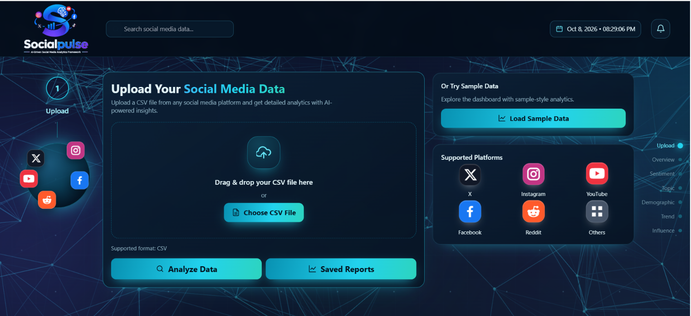

# SocialPulse AI

### An Intelligent Social Media Analytics Framework

SocialPulse AI is an AI-powered social media analytics platform that analyzes uploaded social media data and provides insights into **sentiment, demographics, trending topics, and influence/network connections**.

---
## 📸 Project Preview



## 🚀 Features

- 📊 Social media data analysis from CSV files
- 😊 Sentiment analysis using Machine Learning
- 👥 Demographic analysis
- 🔥 Trending topic / narrative analysis
- 🌐 Influence and network analysis
- 📄 Automatic PDF report generation
- 📈 Dashboard-based visualization of analytics

---

## 🧠 Machine Learning

The sentiment analysis module uses:

- **Algorithm:** Logistic Regression
- **Feature Extraction:** Bag of Words (BoW)
- **Text Preprocessing:** Lemmatization
- **N-grams:** Unigram + Bigram
- **Hyperparameter Tuning:** GridSearchCV

The trained sentiment model is used to classify social media posts into:

- Positive
- Negative
- Neutral

---

## 🛠️ Technology Stack

### Backend
- Python
- FastAPI
- Pandas
- Scikit-learn

### Machine Learning / NLP
- NLTK
- Scikit-learn
- Logistic Regression
- Bag of Words

### Report Generation
- ReportLab

### Frontend
- HTML
- CSS
- JavaScript

---

## 🔄 System Workflow

```text
User Uploads CSV
       ↓
CSV Inspection & Column Mapping
       ↓
Data Preprocessing
       ↓
Sentiment Analysis
       ↓
Demographic Analysis
       ↓
Trending Topic Analysis
       ↓
Influence / Network Analysis
       ↓
Dashboard Results
       ↓
PDF Report
```

## 📊 Analytics Provided

### 1. Sentiment Analysis

The platform analyzes the text of social media posts and classifies them into:

- Positive
- Negative
- Neutral

### 2. Demographic Analysis

The platform analyzes available demographic information such as:

- Age
- Gender
- Location

### 3. Trending Topics

The platform identifies frequently occurring topics or entities in the uploaded social media dataset.

### 4. Influence / Network Analysis

The platform analyzes user interactions based on:

- User mentions
- Mention frequency
- Follower information, when available

---

## 📁 Project Structure

```text
SocialPulse-AI/
│
├── README.md
├── requirements.txt
├── .gitignore
│
├── main.py
├── analysis.py
├── preprocessing.py
├── index.html
├── socialpulse-logo.png
├── dashboard.png
│
├── bow_Vectorizer.pkl
├── bow_sentiment_model.pkl
│
├── 1_data_preprocessing.ipynb
├── 2_NLP.ipynb
├── 3_model_training.ipynb
└── 4_model_validation.ipynb

---
```
## ▶️ How to Run

### 1. Clone the repository

```bash
git clone https://github.com/Manisa-Ghosh-06/SocialPulse-AI.git
```
### 2. Open the project folder
cd SocialPulse-AI

### 3.Install the required dependencies
pip install -r requirements.txt

### 4. Run the FastAPI application
uvicorn main:app --reload

### 5. Open the application
Open the URL provided by FastAPI in your web browser.

## 📓 Machine Learning Notebooks

The project includes separate notebooks for the machine learning workflow:

1) Data Preprocessing – cleaning and preparing the dataset
2) NLP – text preprocessing and feature preparation
3) Model Training – training the sentiment classification model
4) Model Validation – evaluating and validating the trained model

## 🎯 Objective

The objective of SocialPulse AI is to transform raw social media data into meaningful insights about:

       i) Public sentiment
       ii) Audience demographics
       iii) Popular topics
       iv) Emerging narratives
       v) User influence and interactions
